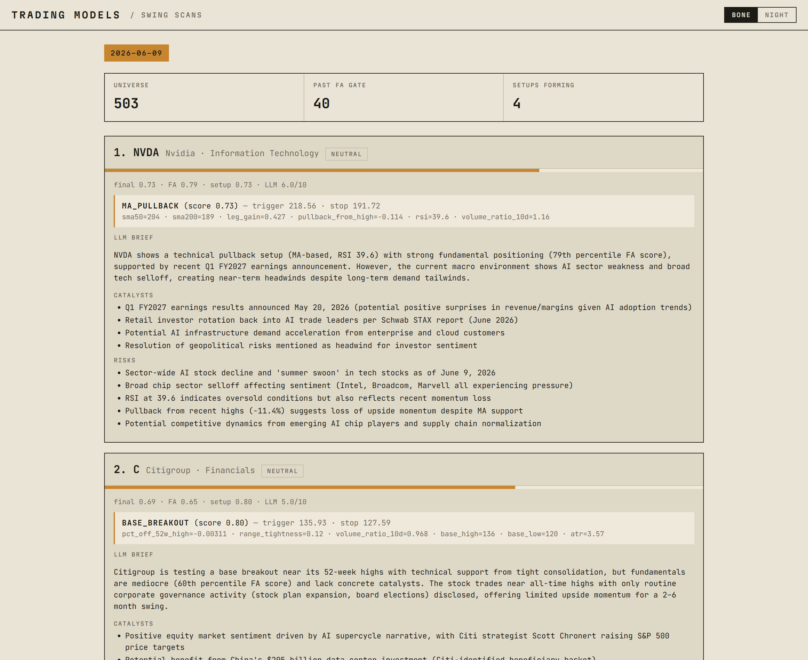

# Trading Models

📄 **[Read the research →](https://vankyle00.github.io/trading-models/docs/index.html)** — two tracks: in-depth **model breakdowns** (one self-contained paper per model) and first-principles **concept writeups** (the theory behind the models).

A growing portfolio of trading models spanning classical quant, machine
learning, market microstructure, and alternative data — across US equities
and crypto.

Each model lives in a self-contained directory under `models/<family>/`
with a reproducible notebook, a `backtest.py` entry point, and standardized
metrics. The shared library in `tradinglib/` provides a unified backtest
engine so every model is measured the same way and the results in the
table below are directly comparable.

## Key features

- **Unified backtest engine** (`tradinglib.backtest`) — one vectorized core
  every model runs through, so PnL and metrics are directly comparable across
  families. Signals are lagged one bar and fill at the **next bar's open** by
  default (no look-ahead, no overnight-gap capture), with linear bps
  transaction costs. An event-driven front-end and a dedicated options engine
  (Greeks, multi-leg payoffs) feed the same core, so a callback-style strategy
  and a vectorized one are scored identically.
- **Standardized metrics** — annualized return, Sharpe, Sortino, max drawdown,
  hit rate, and turnover on every model; assumptions documented in
  [`docs/methodology.md`](docs/methodology.md).
- **Negative results are first-class** — hypotheses that the data rejects ship
  with the same rigor as the winners, inverse direction included.
- **Our own trained assistant model** — the workbench's chat assistant runs on
  a provider abstraction that swaps between the Anthropic API and a self-hosted
  **Qwen2.5-7B** fine-tuned in-house (QLoRA, see below).
- **Live, deployed workbench** — themed FastAPI UI with Plotly charts,
  market-event presets, and the grounded LLM console, running on Modal.

## Live demo

**▶ [Open the workbench →](https://van-kyle-00--trading-models-workbench-fastapi-app.modal.run)**
— the interactive test area, deployed on [Modal](https://modal.com). Pick a
model, jump straight to a notable **market event** (COVID crash, 2022 bear,
GFC 2008, FTX collapse, … — the list adapts to the model's asset class), and
run a backtest over any window. Results render as rich Plotly charts with a
hero metric strip, and a built-in **LLM assistant** answers questions grounded
in the run you're looking at. Bone / night themes, nothing to install.

> First load can take a few seconds — the app scales to zero when idle.

[](https://van-kyle-00--trading-models-workbench-fastapi-app.modal.run)

There's also the original **[Streamlit app](https://trading-models-swqny2mhsqftylrq8hj3w9.streamlit.app/)**,
which serves the same backtests via the shared `tradinglib.service` layer.

### Run the workbench locally

```bash
uv sync
uv run uvicorn webapp.main:app --reload    # FastAPI workbench → http://localhost:8000
uv run streamlit run app/streamlit_app.py  # original Streamlit app
```

The chat assistant uses the Anthropic API — set `ANTHROPIC_API_KEY` in the
environment to enable `/api/v1/chat`. The model defaults to Claude Haiku 4.5;
override with `ASSISTANT_MODEL` (e.g. `claude-sonnet-4-6`). The assistant is a
bounded agent: it can only list models, read a model's spec, and run backtests —
no code execution — with per-session token/run caps and per-IP rate limiting.

### Our own trained model

The assistant is built on an `LLMProvider` protocol (`tradinglib/assistant/`),
so the agent loop never depends on a specific vendor. `ClaudeProvider` is the
default; `LocalAdapterProvider` serves a **self-hosted Qwen2.5-7B-Instruct**
fine-tuned in-house — both implement the same interface and drop in with no
changes to `agent.py` or `tools.py`.

The training track lives under `tradinglib/training/` and `scripts/`:

- **QLoRA fine-tune** — Qwen2.5-7B in 4-bit on a single 16 GB consumer GPU
  (RTX 5080, WSL2), `r=16`/`alpha=32` LoRA across all attention + MLP
  projections. Hyperparameters are pinned dataclasses in
  `tradinglib/training/config.py`.
- **Grounded SFT dataset** — built from real backtest traces
  (`scripts/build_dataset.py`, `tradinglib/dataset/`) so the model learns to
  ground every numeric claim in tool output, matching the bounded-agent
  contract.
- **Swap-in serving** — `LocalAdapterProvider` parses Qwen-style
  `<tool_call>` blocks and speaks the same neutral turn type the agent loop
  expects; heavy deps (torch/peft/bitsandbytes) are lazily imported so CI stays
  GPU-free.

Full runbook (install, smoke test, full run) is in
[`docs/training-assistant.md`](docs/training-assistant.md). Train with:

```bash
uv sync --extra train
uv run python scripts/build_dataset.py
uv run python scripts/train_assistant.py --train data/dataset/train.jsonl \
    --eval data/dataset/eval.jsonl --out adapters/qwen25-7b-assistant
```

### Deploy the workbench

Primary target is **[Modal](https://modal.com)** (`deploy/modal_app.py`):

    uv sync --extra deploy
    uv run modal token new
    uv run modal secret create trading-models-secrets ANTHROPIC_API_KEY=sk-ant-...
    uv run modal deploy deploy/modal_app.py

A `Dockerfile` (+ `render.yaml` blueprint) is also included for container hosts
like Render, Railway, or Fly. The chat degrades gracefully without the API key.
Full steps and the persistent-cache notes are in [`docs/DEPLOY.md`](docs/DEPLOY.md).

## Nightly swing scanner

**▶ [Open the scans page →](https://van-kyle-00--trading-models-workbench-fastapi-app.modal.run/scans)**
— every weekday after the US close (22:00 UTC) a Modal cron sweeps the full
Russell 1000 (~1,000 names; S&P 500 available via `--universe sp500`) for swing setups on the 2-week-to-6-month horizon and publishes a
ranked watchlist to the workbench's `/scans` page: funnel stats up top, then
one card per candidate with the detected setup, trigger/stop levels, and a
grounded LLM brief.

[](https://van-kyle-00--trading-models-workbench-fastapi-app.modal.run/scans)

The funnel (`tradinglib/scanner/`) narrows ~1,000 names to a handful in four
stages — the first two are the **fundamental (FA) gate**:

1. **FA gate, pass 1 — snapshot percentiles.** Six metrics — revenue growth,
   earnings growth, operating margin, debt-to-equity, free-cash-flow yield,
   and forward P/E — are scored as *cross-sectional percentiles* across the
   universe. Forward P/E is percentiled within its GICS sector (so a bank's
   multiple is never judged against a software company's), and the scoring is
   direction-aware: lower debt and a cheaper multiple score higher. A ticker's
   `fa_score` is the mean of the percentiles it actually has, with two hard
   filters: at least 4 of the 6 metrics present, and positive
   trailing-twelve-month revenue. The top 80 by `fa_score` advance.
2. **FA gate, pass 2 — EDGAR trend blend.** For each pass-1 survivor the
   scanner pulls quarterly XBRL companyfacts from SEC EDGAR and computes
   revenue YoY growth, revenue acceleration, and EPS change YoY. Those are
   percentiled among the survivors and blended as
   `0.7 · fa_score + 0.3 · edgar_score`; the re-ranked top 40 pass the gate.
   Tickers EDGAR has no data for keep their unblended score rather than being
   penalized for missing facts.
3. **Setup detection.** Three daily-bar detectors look for setups *forming
   now*: `base_breakout` (tight consolidation near the 52-week high on
   drying-up volume), `ma_pullback` (orderly pullback to a rising 50-day MA
   inside an uptrend), and `pead` (post-earnings-announcement drift after a
   big up-gap on volume). Each emits a 0–1 score plus concrete trigger and
   stop levels.
4. **LLM document briefs + ranking.** Every finalist gets a bounded doc pack —
   the latest 8-K excerpt, the 10-Q/10-K MD&A opening, recent headlines, its
   FA metrics and the detected setup — and one LLM call returns strict JSON
   (thesis, catalysts, risks, red flags, stance, 0–10 qualitative score).
   Final rank is `0.35·FA + 0.45·setup + 0.20·qualitative`; an `avoid` stance
   or any red flag pins the name to the bottom of the list with the reason
   shown — never silently dropped. Candidates reporting earnings within 14
   days carry a warning chip.

The FA gate is two-sided, and the same nightly run also feeds a **strategy
tournament**: the top-N FA names become long candidates and the bottom-N short
candidates, each walk-forward tested (anchored 378/63-bar windows, costs on)
against a registry of classic retail strategies — SMA crossover, Donchian
breakout, RSI(2) pullback, MACD, Bollinger fade. Only survivors clear the bar
(deflated-Sharpe probability ≥ 0.90 corrected for *every* strategy and
parameter tried on that ticker, ≥ 12 OOS trades, stable parameters), and each
surviving winner becomes a **trade ticket**: entry/stop/target from the
winning rule, risk-based sizing, and option structures — including
short-premium spreads, never naked calls — built from the real chain behind a
liquidity gate. Tickets render below the watchlist on `/scans`, and the
strategy registry plus the repo's standalone models are documented at
[`/models`](https://van-kyle-00--trading-models-workbench-fastapi-app.modal.run/models).
Quotes are indicative last/close marks: this is decision support that accrues
a forward paper-trading record, not an auto-trader.

That forward record is kept honest on the
[`/tournaments`](https://van-kyle-00--trading-models-workbench-fastapi-app.modal.run/tournaments)
page: each night's pipeline story (universe → FA gate → tournament verdicts →
tickets) is cataloged by date, and every ticket ever issued is re-scored
nightly by paper-trading its entry/stop/target levels against subsequent
daily bars — status, R-multiple, and price path vs levels, plus a cumulative
hit rate and total R. Entries fill per their trigger type within a 5-session
window; gaps fill at the open, never better than the plan; a bar that touches
both stop and target counts as stopped. Rebuild it locally with
`uv run python scripts/evaluate_tickets.py`.

Run it yourself (`--limit` for a quick smoke run, `--skip-llm` to stop after
setup detection):

```bash
uv run python scripts/swing_scan.py --limit 25 --skip-llm
```

## Current models

| Model | Family | Window | Assets | OOS Sharpe | Max DD | Status |
| --- | --- | --- | --- | --- | --- | --- |
| [SMA Crossover on SPY](https://vankyle00.github.io/trading-models/docs/models/01-sma-crossover-spy.html) | classical | swing | equities | 0.75 | -0.34 | working |
| [XGBoost Next-Day Return on SPY](https://vankyle00.github.io/trading-models/docs/models/02-xgboost-next-day-return-spy.html) | ml | swing | equities | 0.96 | -0.12 | working |
| [Google Trends Contrarian on BTC](https://vankyle00.github.io/trading-models/docs/models/04-google-trends-contrarian-btc.html) | alt-data | swing | crypto | -0.30 | -0.80 | negative-result |
| [Order Flow Imbalance on BTC](https://vankyle00.github.io/trading-models/docs/models/03-order-flow-imbalance-btc.html) | microstructure | intraday | crypto | -86.37 | -0.36 | negative-result |
| [Delta-Hedged Long Option on SPY](https://vankyle00.github.io/trading-models/docs/models/05-delta-hedged-long-option-spy.html) | options | swing | equities | -6.94 | -0.08 | working |
| [Earnings Event-Vol Straddle on SPY](https://vankyle00.github.io/trading-models/docs/models/06-earnings-straddle-spy.html) | options | swing | equities | 0.0 | 0.0 | negative-result |

Rows 3 and 4 are intentional negative results: hypotheses were tested
honestly and the data rejected them. Each model's README documents
what was tested, the inverse direction where applicable, and what the
result implies. Negative results are first-class citizens here — the
alternative is a portfolio of overfit "winners". Row 5 (the delta-hedged
options model) also posts a negative Sharpe by design — it is the
options-pipeline demonstrator (hence status `working`), and its loss is
expected long-volatility theta bleed from pricing above realized vol, not a bug.
Row 6 (the earnings-straddle model) is a Phase-1 synthetic pipeline (elevated
pre-earnings IV plus a parameterized crush, not yet tradeable). A thorough
backtest (216 earnings events across 9 single names, 2020–2026) found **no
statistically significant edge**: the unfiltered long-straddle program bleeds
(−$125.65/trade, p=0.052) and the filtered branch's nominal gain is insignificant
(p=0.78) and an artifact of the assumed synthetic IV — hence `negative-result`.
Its Sharpe and Max DD stay 0.0 because per-bar Sharpe is the wrong lens for a
sparse event trade; the trade-level result lives in the model's `model.md` and
`results/`.

Note on the microstructure Sharpe: the -86.37 number is annualized
assuming 525,600 minute-bars per year. The *direction* (clearly
losing) and the scale-invariant metrics (hit rate 29.7%, drawdown
-36%) are what matter for cross-model comparison; see the model's
README for a daily-bar-equivalent rescaling.

The full sortable index lives in [MODELS.md](MODELS.md) and is
auto-generated from each model's `model.md` frontmatter.

## Roadmap

- **Walk-forward CV** — moving from chronological 80/20 splits to rolling
  walk-forward as the default for the ML family.
- **Vendor-grade equities loaders** — Polygon or Alpaca to replace
  yfinance for production-quality bars.
- **L2-derived OFI** — the trade-side OFI experiment was a negative
  result; the next iteration uses depth-update events for a proper
  book-imbalance signal. Requires a WebSocket capture loader.
- **More alt-data sources** — NewsAPI + a proper headline-sentiment
  model is the next experiment worth running on that front.

## Repository tour

| Directory | What lives there |
| --- | --- |
| `webapp/` | FastAPI workbench (the live demo) — themed UI, Plotly charts, market-event presets, LLM chat console |
| `app/` | Streamlit GUI for browsing models + running backtests interactively |
| `deploy/` | `modal_app.py` — Modal deployment of the workbench (see [`docs/DEPLOY.md`](docs/DEPLOY.md)) |
| `tradinglib/` | Shared package — data, features, backtest engine, metrics, viz |
| `tradinglib/backtest/` | Vectorized + event-driven engines, options engine, standardized metrics |
| `tradinglib/loaders/` | Data loaders, one subpackage per asset class |
| `tradinglib/assistant/` | Bounded LLM agent loop + provider abstraction (Claude / own Qwen adapter) |
| `tradinglib/training/` | QLoRA fine-tuning glue + pinned hyperparameter config |
| `tradinglib/dataset/` | Grounded SFT dataset builder from real backtest traces |
| `data/ingestion/` | Documentation of each data source |
| `models/classical/` | Mean reversion, momentum, pairs trading, statistical arbitrage |
| `models/ml/` | Gradient boosting, LSTMs, transformers |
| `models/microstructure/` | Orderbook imbalance, microprice, queue dynamics (empty for now) |
| `models/options/` | Options pricing, Greeks, multi-leg payoffs, vol strategies |
| `models/alt-data/` | Sentiment, news, alternative signals (empty for now) |
| `notebooks/eda/` | Exploratory analyses not tied to a single model |
| `docs/` | Research hub (`docs/index.html`), glossary, data sources, backtest methodology, latency notes |
| `docs/models/` | Working papers — one empirical breakdown per model (the model catalogue) |
| `docs/concepts/` | Concept writeups — first-principles theory behind the signals |
| `scripts/` | Maintenance scripts (e.g., regenerating `MODELS.md`) |
| `tests/` | Unit tests for `tradinglib`, the `webapp`, and the LLM assistant |

## Quick start

```bash
git clone https://github.com/<you>/trading-models.git
cd trading-models
uv sync --extra dev    # `uv sync` alone is enough if you only want to run the app
cp .env.example .env   # fill in any API keys you need (none required for the seed models)
```

Run the tests:

```bash
uv run pytest
```

Reproduce a model's backtest:

```bash
uv run python models/classical/01-sma-crossover-spy/backtest.py
```

Train + backtest the ML model:

```bash
uv run python models/ml/01-gbm-next-day-return-spy/train.py
uv run python models/ml/01-gbm-next-day-return-spy/backtest.py
```

Add a new model? Drop it under `models/<family>/NN-slug/` with a
`model.md` frontmatter block, then regenerate the index:

```bash
uv run python scripts/regenerate_models_index.py
```

## Methodology

Every model is evaluated with the same backtest engine
(`tradinglib.backtest`) and reports the same metrics: annualized return,
Sharpe ratio, Sortino ratio, maximum drawdown, hit rate, and turnover.
Assumptions about slippage, transaction costs, look-ahead bias prevention,
and the train/test split discipline are documented in
[`docs/methodology.md`](docs/methodology.md).

New to systematic trading? Start with the
[**glossary**](docs/glossary.md) — terms are defined plainly with the
context needed to follow the rest of the repo. Wondering when you'd need to
leave Python for C++? See [`docs/latency-notes.md`](docs/latency-notes.md).

Want the theory behind a signal, not just its backtest? The
[**concept writeups**](https://vankyle00.github.io/trading-models/docs/concepts/index.html) develop the recurring
ideas from first principles — the first,
[*How Order Flow Shapes Liquidity*](https://vankyle00.github.io/trading-models/docs/concepts/01-order-flow-and-liquidity.html),
is the theory behind the microstructure model. Both tracks are reachable
from the [research index](https://vankyle00.github.io/trading-models/docs/index.html).

## Status

Six models live across all five families (classical, ML, microstructure,
options, alt-data), including intentional negative results. The shared
backtest engine, the deployed FastAPI workbench, and the bounded LLM
assistant are all in production; the own-trained Qwen2.5-7B provider is the
active track. The structure is ready to absorb additional models — see the
roadmap above for what's next.
