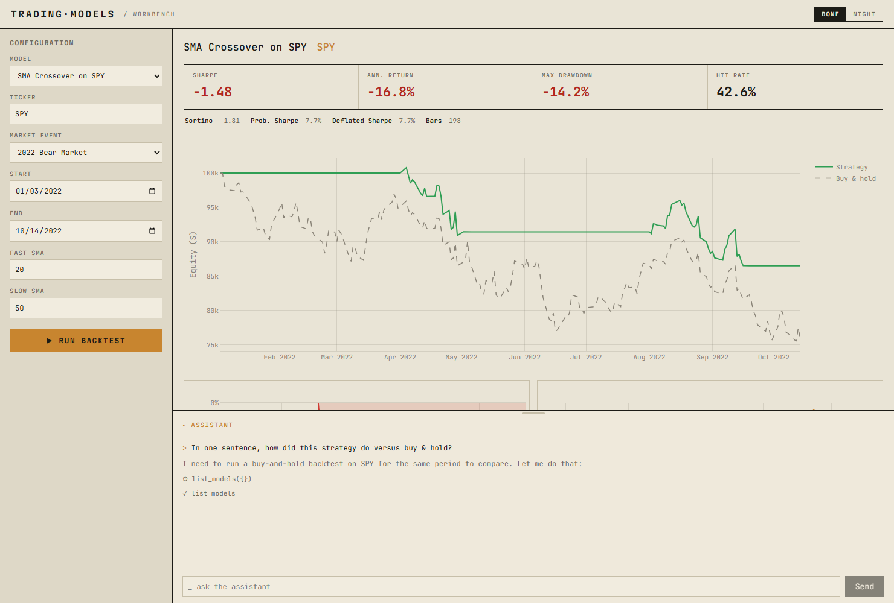

# Trading Models

📄 **[Read the research →](https://vankyle00.github.io/trading-models/docs/index.html)** — two tracks: in-depth **model breakdowns** (one self-contained paper per model) and first-principles **concept writeups** (the theory behind the models).

A growing portfolio of trading models spanning classical quant, machine
learning, market microstructure, and alternative data — across US equities
and crypto.

Each model lives in a self-contained directory under `models/<family>/`
with a reproducible notebook, a `backtest.py` entry point, and standardized
metrics. The shared library in `tradinglib/` provides a unified backtest
engine so every model is measured the same way and the results in the
table below are directly comparable.

## Live demo

**▶ [Open the workbench →](https://van-kyle-00--trading-models-workbench-fastapi-app.modal.run)**
— the interactive test area, deployed on [Modal](https://modal.com). Pick a
model, jump straight to a notable **market event** (COVID crash, 2022 bear,
GFC 2008, FTX collapse, … — the list adapts to the model's asset class), and
run a backtest over any window. Results render as rich Plotly charts with a
hero metric strip, and a built-in **LLM assistant** answers questions grounded
in the run you're looking at. Bone / night themes, nothing to install.

> First load can take a few seconds — the app scales to zero when idle.

[](https://van-kyle-00--trading-models-workbench-fastapi-app.modal.run)

There's also the original **[Streamlit app](https://trading-models-swqny2mhsqftylrq8hj3w9.streamlit.app/)**,
which serves the same backtests via the shared `tradinglib.service` layer.

### Run the workbench locally

```bash
uv sync
uv run uvicorn webapp.main:app --reload    # FastAPI workbench → http://localhost:8000
uv run streamlit run app/streamlit_app.py  # original Streamlit app
```

The chat assistant uses the Anthropic API — set `ANTHROPIC_API_KEY` in the
environment to enable `/api/v1/chat`. The model defaults to Claude Haiku 4.5;
override with `ASSISTANT_MODEL` (e.g. `claude-sonnet-4-6`). The assistant is a
bounded agent: it can only list models, read a model's spec, and run backtests —
no code execution — with per-session token/run caps and per-IP rate limiting.

### Deploy the workbench

Primary target is **[Modal](https://modal.com)** (`deploy/modal_app.py`):

    uv sync --extra deploy
    uv run modal token new
    uv run modal secret create trading-models-secrets ANTHROPIC_API_KEY=sk-ant-...
    uv run modal deploy deploy/modal_app.py

A `Dockerfile` (+ `render.yaml` blueprint) is also included for container hosts
like Render, Railway, or Fly. The chat degrades gracefully without the API key.
Full steps and the persistent-cache notes are in [`docs/DEPLOY.md`](docs/DEPLOY.md).

## Current models

| Model | Family | Window | Assets | OOS Sharpe | Max DD | Status |
| --- | --- | --- | --- | --- | --- | --- |
| [SMA Crossover on SPY](https://vankyle00.github.io/trading-models/docs/models/01-sma-crossover-spy.html) | classical | swing | equities | 0.75 | -0.34 | working |
| [XGBoost Next-Day Return on SPY](https://vankyle00.github.io/trading-models/docs/models/02-xgboost-next-day-return-spy.html) | ml | swing | equities | 0.96 | -0.12 | working |
| [Google Trends Contrarian on BTC](https://vankyle00.github.io/trading-models/docs/models/04-google-trends-contrarian-btc.html) | alt-data | swing | crypto | -0.30 | -0.80 | negative-result |
| [Order Flow Imbalance on BTC](https://vankyle00.github.io/trading-models/docs/models/03-order-flow-imbalance-btc.html) | microstructure | intraday | crypto | -86.37 | -0.36 | negative-result |
| [Delta-Hedged Long Option on SPY](https://vankyle00.github.io/trading-models/docs/models/05-delta-hedged-long-option-spy.html) | options | swing | equities | -6.94 | -0.08 | working |

Rows 3 and 4 are intentional negative results: hypotheses were tested
honestly and the data rejected them. Each model's README documents
what was tested, the inverse direction where applicable, and what the
result implies. Negative results are first-class citizens here — the
alternative is a portfolio of overfit "winners". Row 5 (the delta-hedged
options model) also posts a negative Sharpe by design — it is the
options-pipeline demonstrator (hence status `working`), and its loss is
expected long-volatility theta bleed from pricing above realized vol, not a bug.

Note on the microstructure Sharpe: the -86.37 number is annualized
assuming 525,600 minute-bars per year. The *direction* (clearly
losing) and the scale-invariant metrics (hit rate 29.7%, drawdown
-36%) are what matter for cross-model comparison; see the model's
README for a daily-bar-equivalent rescaling.

The full sortable index lives in [MODELS.md](MODELS.md) and is
auto-generated from each model's `model.md` frontmatter.

## Roadmap

- **Walk-forward CV** — moving from chronological 80/20 splits to rolling
  walk-forward as the default for the ML family.
- **Vendor-grade equities loaders** — Polygon or Alpaca to replace
  yfinance for production-quality bars.
- **L2-derived OFI** — the trade-side OFI experiment was a negative
  result; the next iteration uses depth-update events for a proper
  book-imbalance signal. Requires a WebSocket capture loader.
- **More alt-data sources** — NewsAPI + a proper headline-sentiment
  model is the next experiment worth running on that front.

## Repository tour

| Directory | What lives there |
| --- | --- |
| `webapp/` | FastAPI workbench (the live demo) — themed UI, Plotly charts, market-event presets, LLM chat console |
| `app/` | Streamlit GUI for browsing models + running backtests interactively |
| `deploy/` | `modal_app.py` — Modal deployment of the workbench (see [`docs/DEPLOY.md`](docs/DEPLOY.md)) |
| `tradinglib/` | Shared package — data, features, backtest engine, metrics, viz |
| `tradinglib/loaders/` | Data loaders, one subpackage per asset class |
| `data/ingestion/` | Documentation of each data source |
| `models/classical/` | Mean reversion, momentum, pairs trading, statistical arbitrage |
| `models/ml/` | Gradient boosting, LSTMs, transformers |
| `models/microstructure/` | Orderbook imbalance, microprice, queue dynamics (empty for now) |
| `models/options/` | Options pricing, Greeks, multi-leg payoffs, vol strategies |
| `models/alt-data/` | Sentiment, news, alternative signals (empty for now) |
| `notebooks/eda/` | Exploratory analyses not tied to a single model |
| `docs/` | Research hub (`docs/index.html`), glossary, data sources, backtest methodology, latency notes |
| `docs/models/` | Working papers — one empirical breakdown per model (the model catalogue) |
| `docs/concepts/` | Concept writeups — first-principles theory behind the signals |
| `scripts/` | Maintenance scripts (e.g., regenerating `MODELS.md`) |
| `tests/` | Unit tests for `tradinglib`, the `webapp`, and the LLM assistant |

## Quick start

```bash
git clone https://github.com/<you>/trading-models.git
cd trading-models
uv sync --extra dev    # `uv sync` alone is enough if you only want to run the app
cp .env.example .env   # fill in any API keys you need (none required for the seed models)
```

Run the tests:

```bash
uv run pytest
```

Reproduce a model's backtest:

```bash
uv run python models/classical/01-sma-crossover-spy/backtest.py
```

Train + backtest the ML model:

```bash
uv run python models/ml/01-gbm-next-day-return-spy/train.py
uv run python models/ml/01-gbm-next-day-return-spy/backtest.py
```

Add a new model? Drop it under `models/<family>/NN-slug/` with a
`model.md` frontmatter block, then regenerate the index:

```bash
uv run python scripts/regenerate_models_index.py
```

## Methodology

Every model is evaluated with the same backtest engine
(`tradinglib.backtest`) and reports the same metrics: annualized return,
Sharpe ratio, Sortino ratio, maximum drawdown, hit rate, and turnover.
Assumptions about slippage, transaction costs, look-ahead bias prevention,
and the train/test split discipline are documented in
[`docs/methodology.md`](docs/methodology.md).

New to systematic trading? Start with the
[**glossary**](docs/glossary.md) — terms are defined plainly with the
context needed to follow the rest of the repo. Wondering when you'd need to
leave Python for C++? See [`docs/latency-notes.md`](docs/latency-notes.md).

Want the theory behind a signal, not just its backtest? The
[**concept writeups**](https://vankyle00.github.io/trading-models/docs/concepts/index.html) develop the recurring
ideas from first principles — the first,
[*How Order Flow Shapes Liquidity*](https://vankyle00.github.io/trading-models/docs/concepts/01-order-flow-and-liquidity.html),
is the theory behind the microstructure model. Both tracks are reachable
from the [research index](https://vankyle00.github.io/trading-models/docs/index.html).

## Status

Foundation + two seed models live. The structure is ready to absorb
additional models in any of the four families — see the roadmap above for
what's next.
